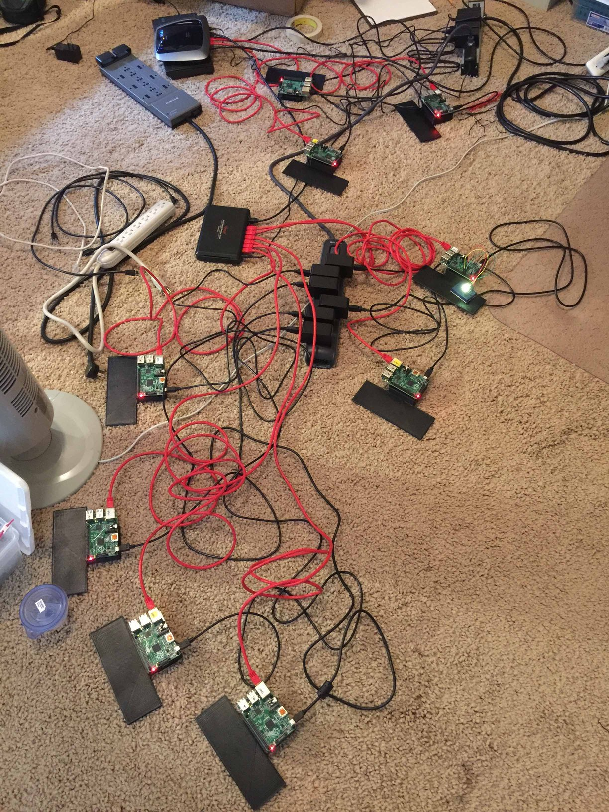

# rpi-hw-js-demo

A collection of documents and code for October 2015 NoCo JavaScript Meetup

- [Slides](http://dpcrook.github.io/rpi-hw-js-demo/index.html)
  - [slides](http://dpcrook.github.io/rpi-hw-js-demo/RGB-LED-demo.html) for  [demo pt. 1](https://github.com/dpcrook/rpi-hw-js-demo/blob/gh-pages/demo_notes/demo1.md)
  - [demo pt. 2](https://github.com/dpcrook/rpi-hw-js-demo/blob/gh-pages/demo_notes/demo2.md)
  - Code (see below for more on how Pi's were configured): 
    - [rgb-slider](https://github.com/dpcrook/rgb-slider) - node.js app, runs on Pi
    - [local webserver](https://github.com/dpcrook/rpi-hw-js-demo/tree/master/localweb) just-in-case
  
## outline

 - [x] [Meetup Event Page](http://www.meetup.com/NoCo-JavaScript-Meetup/events/224542835/)
   - [x] [Network info](http://dpcrook.github.io/rpi-hw-js-demo/network.html)
   - [x] Teaser slides
 
 - [x] [Introduction Slides](http://dpcrook.github.io/rpi-hw-js-demo/index.html)
 - [x] RGB LED demo
   - [x] [Configuring the Pis](doc/Configure_Raspian.md) - @dpcrook already has done this part
     - [x] [info](doc/rgb-slider.md)
     - [x] [code](https://github.com/dpcrook/rgb-slider)
   - [x] [demo, pt. 1](http://dpcrook.github.io/rpi-hw-js-demo/RGB-LED-demo.html)
     - [x] Demo webpage and sliders
     - [x] Background on LEDs
     - [x] wiring instructions
     - [x] instructions on connecting via SSH and launching the node server
   - [x] demo, pt. 2
     - [x] Describe key components of the code on server and client
     - [x] Describe PWM and HSV color
     - [x] Ideas for improvements
   
## Related repos

- [Source code for RGB demo](https://github.com/dpcrook/rgb-slider)

# Current status

See you [Monday at the Meetup](http://www.meetup.com/NoCo-JavaScript-Meetup/events/224542835/)

## early status

