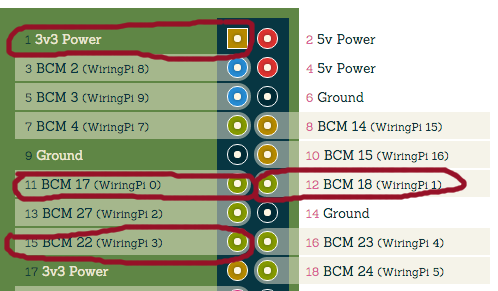

# server side JavaScript
## Inspect index.js

```
# assumes we are in a running screen session

# List windows, using the Command key plus double-quote
<Ctrl>-a "

# select a free window, or create another one with 'Ctrl>-a c'

# go to project directory if you are not there
cd ~/rgb-slider

# look at the server file
less index.js

# 'q' quits less
```

### what is going on in the server index.js?
`index.js` is a Node.js app that creates a web server and can control I/O pins on the Raspberry Pi in response to web-issued commands.

Code available on GitHub: [https://github.com/dpcrook/rgb-slider](https://github.com/dpcrook/rgb-slider)

```javascript
var piblaster = require('pi-blaster.js');
// ...
var RED_GPIO_PIN = 17;
var GREEN_GPIO_PIN = 18;
var BLUE_GPIO_PIN = 22;
```

We are using an NPM module that allows us to control I/O pins on the Raspberry Pi. The particular library, [pi-blaster.js](https://github.com/sarfata/pi-blaster.js) can output a PWM (pulse-width modulated) signal on a set of [Pi header pins](https://github.com/sarfata/pi-blaster/blob/master/pi-blaster.c#L48-60).

This code is using the `GPIO pins {17, 18, 22}` for the Red Green and Blue wires. These are labeled `BCM 17`, `BCM 18`, and `BCM 22` here:



Another view:


### Handling colors
A PWM signal can generate a signal with a specified duty cycle (on/off ratio).  The way the `pi-blaster.js` library works is that you call a function with the GPIO pin number and a value between `0` (OFF) and `1` (On 100%).

```javascript
piblaster.setPwm(22, 0.2 );    // 20% brightness
```

This capability is used to mix the LED light colors.


external link: [Introduction to Pulse Width Modulation](http://www.embedded.com/electronics-blogs/beginner-s-corner/4023833/Introduction-to-Pulse-Width-Modulation)

#### Code to handle a color in web request

```javascript
app.get('/red/:value', function (req, res) {
    console.log("red = " + req.params.value);
    var redValue = req.params.value;
    if( !isNaN( parseInt(redValue) ) ){
        piblaster.setPwm(RED_GPIO_PIN, covertToCommonType(redValue)/255);
        res.send('ok');
    } else {
        res.status(400).send('error');
    }
});
```

Since values between `0`-`255` are being sent from browser client, they are converted to a value from `0.0`-`1.0` by dividing by `255` to get a value between `0.0`-`1.0`.  The `piblaster` library `setPwm` then writes this value into Pi hardware registers so that the pin generates a PWM output waveform.

**NOTE**: the lack of value checking (among other missing checks) in the code is _appalling_!  I know!

# Client side JavaScript
Some of the salient details.

## public/auto-slider.html
Create some elements in the document.  These will be used to hold and style the sliders.

```html
<div id="red"></div>
<div id="green"></div>
<div id="blue"></div>
```

Create some buttons to control the `auto-slider` routines:

```html
<div id="clickbuttons">
  <button class="big" onclick="startTimer()">Start/Resume</button>
  <button class="big" onclick="pause()">Pause</button>
  <button class="big" onclick="abortTimer()">Stop</button>
</div>
```

## public/script.js
The sliders are jQuery-UI components.

### Slider creation


```javascript
// Main start. Will create the sliders and assign the default values
$(function() {

  $( "#red, #green, #blue" ).slider({
    orientation: "horizontal",
    range: "min",
    max: 255,
    value: 0,
    slide: refreshSwatch,
  });

  $( "#red" ).slider({change: function( event, ui ) {
    var redValue = $( "#red" ).slider( "value" );
    $.get( "/red/"+ redValue , function() {});
  }});

  $( "#green" ).slider({change: function( event, ui ) {
    var greenValue = $( "#green" ).slider( "value" );
    $.get( "/green/"+ greenValue , function() {});
  }});

  $( "#blue" ).slider({change: function( event, ui ) {
    var blueValue = $( "#blue" ).slider( "value" );
    $.get( "/blue/"+ blueValue , function() {});
  }});

});
```

Each slider, upon a change event, will perform a `GET` request to its respective color URI.

### show me the colors

```javascript
nextColor = HSVtoRGB(my_state.hue, my_state.saturation, my_state.value);
setSlidersToRGB (nextColor);
```

The sliders are jQuery-UI components.  We can access through the DOM.

We set the GUI components slider values directly in JavaScript in the `setSlidersToRGB` function with jQuery.

```javascript
function setSlidersToRGB (r, g, b) {
    if (arguments.length === 1) {
        g = r.g, b = r.b, r = r.r;
    }

    $( "#red" ).slider( "value", r);
    $( "#green" ).slider( "value", g);
    $( "#blue" ).slider( "value", b);
}
```

### HSV color system


From "Introduction to color theory-The hue-saturation-value (HSV) color model" [External link](http://infohost.nmt.edu/tcc/help/pubs/colortheory/web/hsv.html)

### color-cycling code

HSV encoding allows use to sweep a color space with simple incrementing along the **`H`ue** axis. So the following JavaScript (found in `function colorIncrement()`) is the essence of that.  The other code and parameters basically tweak how fast this is done.

```javascript
if (my_state.countUp) {
  my_state.hue = my_state.hue + 1.0/my_state.autoNumberOfSteps;
} else {
  my_state.hue = my_state.hue - 1.0/my_state.autoNumberOfSteps;
}
```

#### configuration variables in public/script.js

```javascript
var startAuto = false;

// number of milliseconds between color change calls
var interval = 200;

// number of steps along the HSV scale
my_state.autoNumberOfSteps = 64;

// starting value
my_state.hue = 0.0;
my_state.saturation = 1.0;
my_state.value = 1.0;

// starting direction
my_state.countUp = true;

// different color strategy
my_state.colorStrategy = 2;
```
