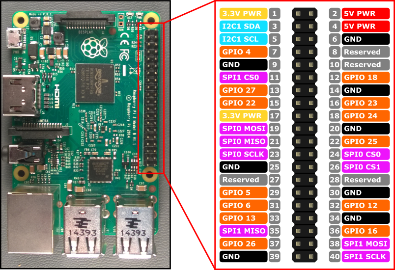

# How to hook up?

From `rgb-slider/index.js` we have:

```javascript
var RED_GPIO_PIN = 17;
var GREEN_GPIO_PIN = 18;
var BLUE_GPIO_PIN = 22;
```

Referring to the table below, those GPIO pins correspond to header pins `P1-11`,
`P1-12`, and `P1-15` respectively.

We'll use the 3.3V power source for our RGB LED too, along with some current
limiting resistors. `P1-1` is the 3.3V PWR.


from https://github.com/sarfata/pi-blaster/blob/master/README.md

## How to use

pi-blaster creates a special file (FIFO) in `/dev/pi-blaster`. Any application on your Raspberry Pi can write to it (this means that only pi-blaster needs to be root, your application can run as a normal user).

**Important: when using pi-blaster, the GPIO pins you send to it are configured as output.**

To set the value of a PIN, you write a command to `/dev/pi-blaster` in the form `<GPIOPinName>=<value>` where `<value>` must be a number between 0 and 1 (included).

      GPIO number   Pin in P1 header
          4              P1-7
          17             P1-11
          18             P1-12
          21             P1-13
          22             P1-15
          23             P1-16
          24             P1-18
          25             P1-22



<sub><em>Image made with <a href="http://fritzing.org/">Fritzing</a></em></sub>


# Acknowledgements

- https://github.com/Kylir/rgb-slider project had the code available for this.

- https://github.com/sarfata/pi-blaster project is a library for generating PWM
on the Raspberry Pi GPIOs
  - there is a node wrapper for it: https://github.com/sarfata/pi-blaster.js


# License

MIT License: see LICENSE

